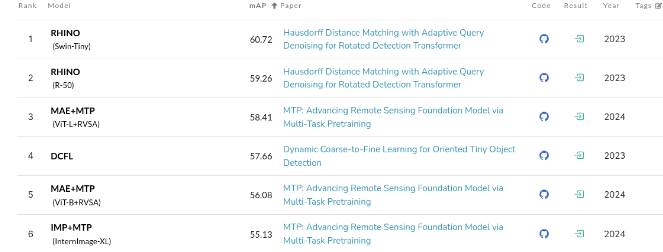
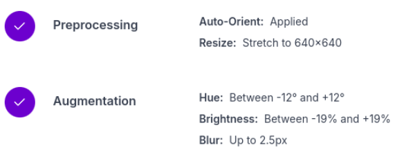
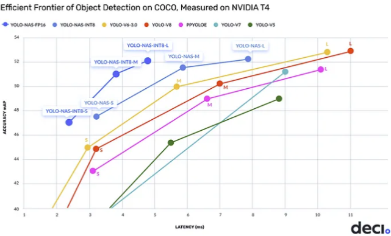
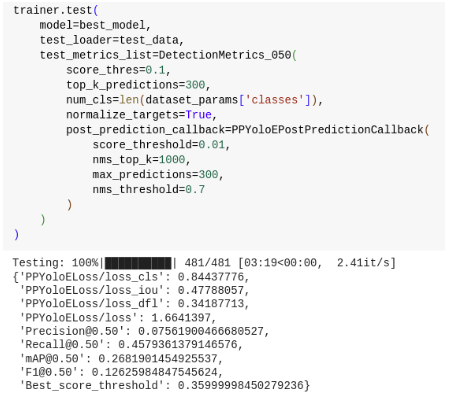
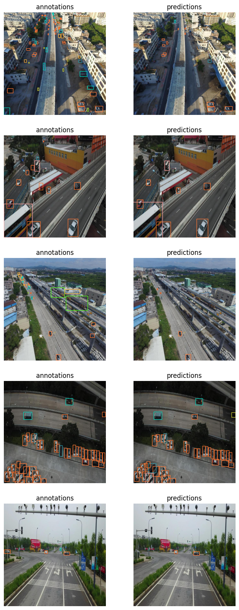
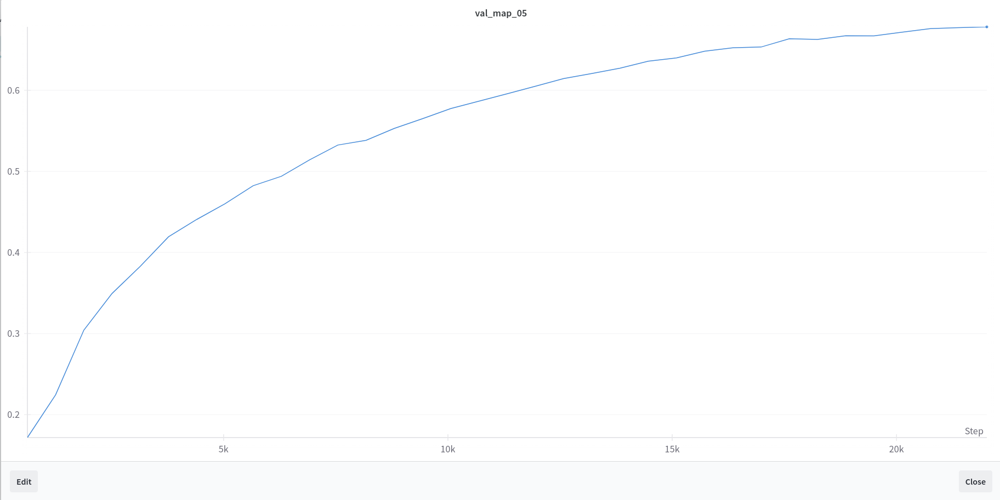
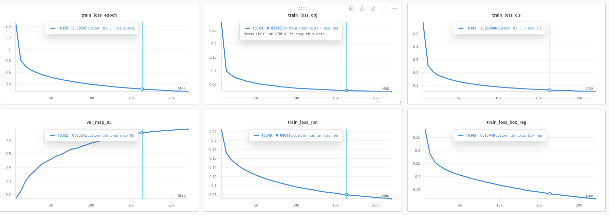
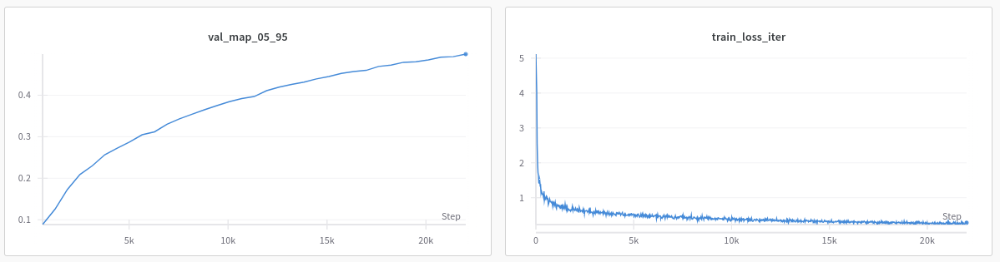
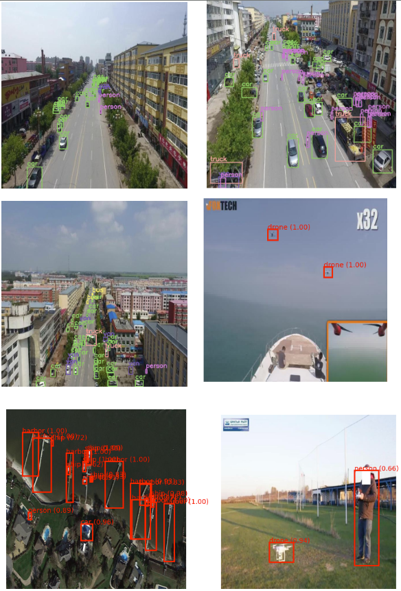
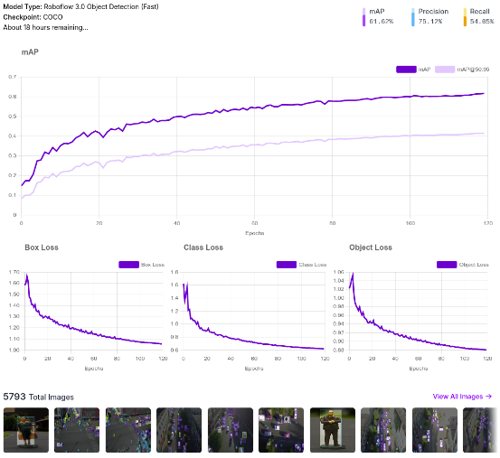

# Long Range Object Detection Project

## Overview
This project focuses on long-range object detection, leveraging aerial imagery and various deep learning models. Our primary goal was to detect objects in different weather conditions using existing datasets and models, with modifications for improved performance.

## Dataset
1. **DOTA v2 Dataset**: Initially, we used the DOTA v2 dataset, which is designed for object detection in aerial images. Although the existing models for this huge dataset have around 60 mAP.  However, it includes many unnecessary classes for our specific task.

2. **Data Refinement**:
   - We used **RoboFlow** to refine the dataset, selecting only the relevant images from DOTA.
   - Additional images, specifically focusing on pedestrians from both aerial and ground datasets, were added.
   - Final classes: `['bicycle', 'bus', 'car', 'drone', 'harbor', 'large-vehicle', 'person', 'plane', 'ship', 'small-vehicle', 'storage-tank', 'truck', 'van']`.
   - Dataset Link: https://app.roboflow.com/myws-v1e5m/bbb_hack/4
3. **Augmentation**: Various augmentations were applied to account for different weather conditions, resulting in a final dataset of over 5,500 images.

## Model Implementations
### YOLO-NAS
- We initially opted for **YOLO-NAS** due to its good balance between accuracy (mAP) and latency.

- Despite training for 25 epochs, the results were not satisfactory for all classes, leading us to refine the classes further.

- **Dependencies:**
  `super-gradients`
  `roboflow`
  `supervision`
### FasterRCNN
- For better accuracy, we moved to **FasterRCNN**.
- Trained **fasterrcnn_resnet50_fpn_v2** for 35 epochs using [this pipeline](https://github.com/sovit-123/fasterrcnn-pytorch-training-pipeline).
- Achieved a validation mAP of **0.678**.

### Roboflow 3.0 Object Detection (Fast)
- We also trained the **Roboflow 3.0 Object Detection (Fast)** model.
- Achieved an mAP of **61%**, but we ran out of time during the hackathon before further training could improve results.

## Future Improvements
- **2-Stage Detection Model**:
  1. Detect 'small objects' and 'large objects' using a detection model.
  2. Use a classification model to further classify the detected objects.
  3. For real-time performance, consider **tinyYOLO** or **SSD** models.
  
- **SSD300**: This model offers an excellent balance between speed and accuracy and could be a good alternative to the current models.

## Conclusion
While our hackathon time limited further improvements, this project demonstrated the potential for using existing datasets and refined models for long-range object detection tasks.
---
